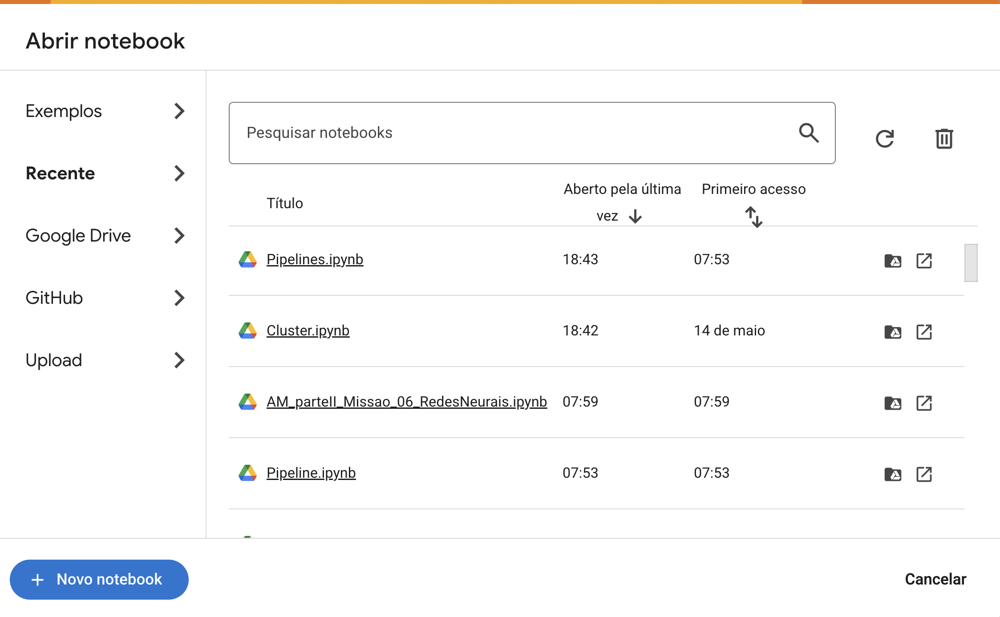
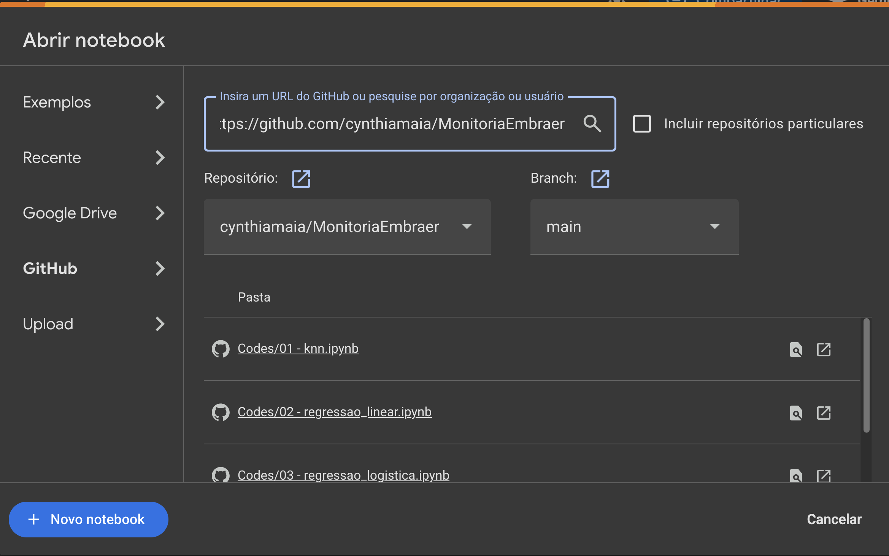

# Monitoria Embraer
## Passo a Passo para uso do Google Colab

### 1. Entre em https://colab.research.google.com. Após o login, será mostrada a tela abaixo com os notebooks mais recentes que você abriu.

### 2. Clique na aba GitHub e insira o link do repositório https://github.com/cynthiamaia/MonitoriaEmbraer. Após isso, todos os notebooks no repositório ficarão visíveis, e você poderá abri-los em uma nova guia.
