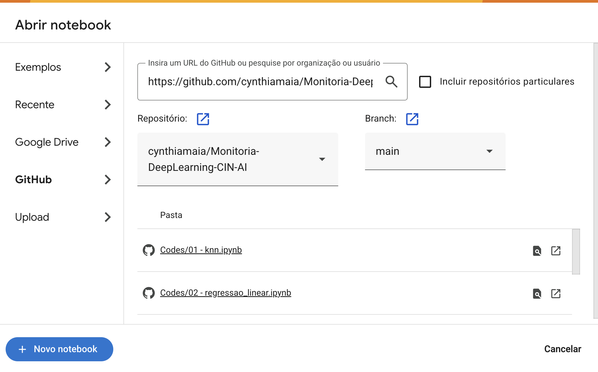

# Monitoria Embraer
## Passo a Passo para uso do Google Colab

### 1. Entre em https://colab.research.google.com. Após o login, será mostrada a tela abaixo com os notebooks mais recentes que você abriu.

### 2. Clique na aba GitHub e insira o link do repositório https://github.com/cynthiamaia/MonitoriaEmbraer. Após isso, todos os notebooks no repositório ficarão visíveis, e você poderá abri-los em uma nova guia.

### 3. Com o notebook aberto, você poderá programar e executá-lo livremente. Para executar uma célula de código, basta posicionar o mouse sobre ela e clicar no botão que aparece no canto superior esquerdo, ou então clicar na célula e pressionar Ctrl + Enter. Se a célula gerar algum resultado, ele será exibido logo abaixo dela. 
